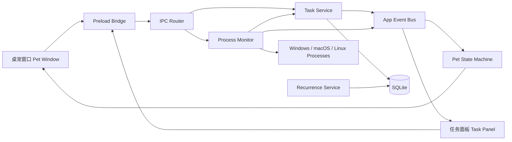
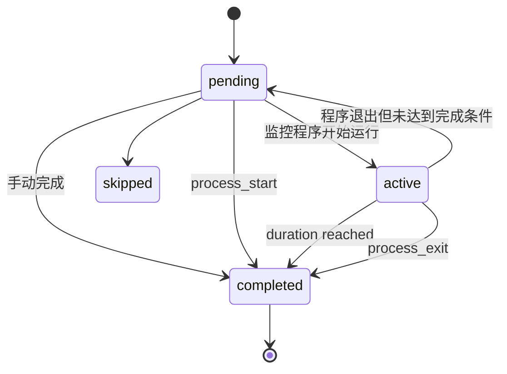
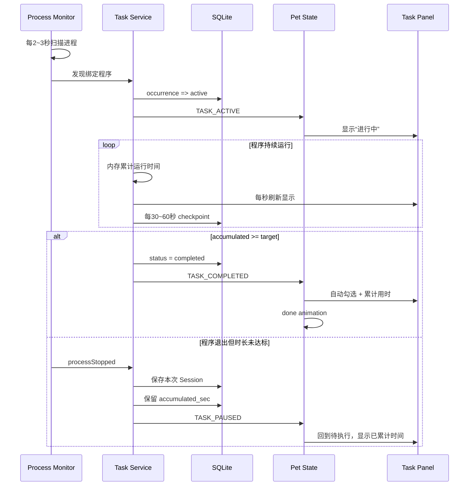

# 任务完成桌宠小助手——软件设计规划书

> 暂定项目代号：**TaskPet / DonePet**  
> 文档版本：v1.1  
> 规划日期：2026-08-23  
> 目标平台：**Windows 10/11 优先**，架构保留 macOS / Linux 兼容能力  
> 推荐实现路线：**Electron + TypeScript + 本地 SQLite + Codex-compatible pet spritesheet**

> v1.1 核心调整：
> - 保持“运行满指定分钟数自动完成”为核心默认模式；
> - 删除“前台活跃时间”计时方案；
> - 程序退出时停止计时并保留累计时长，不因退出自动完成；
> - TaskPet 只关注用户主动绑定到任务的程序，不持续记录用户全部电脑活动；
> - 进程扫描、UI 计时、SQLite 持久化采用不同频率，降低常驻资源占用。


---

## 1. 项目概述

### 1.1 项目目标

开发一个常驻电脑桌面的轻量“任务完成桌宠小助手”。

桌宠平时以小型透明窗口显示在桌面最上层，支持拖拽移动和基础动画。用户点击桌宠后弹出任务面板，可以自行创建、编辑和完成任务。

任务分为：

1. **每日任务**
   - 每天自动生成当天的待办状态；
   - 前一天的完成记录保留；
   - 新的一天自动恢复为未完成；
   - 后续可扩展工作日、每周、指定星期等重复规则。

2. **一次性任务**
   - 创建后只需要完成一次；
   - 完成后保留在历史记录；
   - 可归档，不再出现在今日任务列表。

核心特色是将任务与本地程序关联。

例如：

- “使用 Codex 写代码 40 分钟” → `Codex.exe`
- “背单词 20 分钟” → 某英语学习软件
- “画画 60 分钟” → `Photoshop.exe`
- “运动记录 30 分钟” → 某桌面训练程序

TaskPet 的核心产品定义：

> **TaskPet 不是持续记录用户电脑上运行了什么，而是只关注用户主动绑定给任务的程序；当绑定程序出现时，TaskPet 将任务自动切换为执行中，当绑定程序退出时，根据任务规则停止本次计时并保留累计执行时间；当累计运行时间达到任务设定目标时，任务自动完成并勾选。**

当监控到对应程序运行时：

- 桌宠进入“正在执行任务”状态；
- 面板中的任务显示为“进行中”；
- 只累计用户主动绑定程序的运行时间；
- 程序退出时停止本次计时，不清零；
- 下次再次运行同一绑定程序时继续累计；
- 累计达到目标时长后自动完成；
- 任务完成后显示累计用时；
- 桌宠播放简短“完成”动画。

本软件不需要复杂桌宠养成系统，重点是：

> **“低打扰地把待办事项和实际电脑行为连接起来。”**

---

# 2. 产品定位

## 2.1 核心价值

传统 Todo 软件依赖用户主动打开、主动勾选。

TaskPet 增加一层“行为感知”：

```text
创建任务
   ↓
关联程序
   ↓
用户开始实际行动
   ↓
TaskPet 检测到程序运行
   ↓
任务自动进入进行中
   ↓
达到完成规则
   ↓
自动勾选 + 记录时长 + 桌宠反馈
```

这样桌宠不只是装饰，而是一个可视化的任务状态提示器。

---

## 2.2 设计原则

### 原则 A：桌宠简单，任务功能优先

不把时间花在复杂动作、骨骼动画、养成系统、聊天系统上。

首版宠物只需要：

- idle：待机
- working：任务执行中
- done：任务完成
- attention：提醒
- drag-left / drag-right：可选，拖拽时使用

### 原则 B：默认本地运行

任务、程序路径、运行记录全部存储在本机。

MVP 不需要：

- 用户账号
- 云同步
- 在线数据库
- AI 服务
- 远程统计

### 原则 C：自动化必须可解释

任何自动完成都应该能回答：

> “为什么这个任务被自动完成了？”

例如：

```text
完成原因：检测到 Visual Studio Code
检测时间：20:11
累计运行：32 分 18 秒
完成规则：累计运行 ≥ 30 分钟
```

### 原则 D：监控尽量少侵犯隐私

默认只读取：

- 与“尚未完成且已绑定程序的任务”有关的进程 PID；
- 进程名称；
- 可执行文件路径（可以读取时）；
- 目标程序当前是否运行。

默认不持续记录或保存系统完整进程历史，也不读取：

- 文档内容
- 浏览器网页内容
- 输入内容
- 剪贴板
- 文件内容
- 屏幕截图
- 键盘记录
- 当前前台窗口内容

监控的目的仅是判断：

> **“用户主动绑定给任务的目标程序，现在是否正在运行。”**

---

# 3. GitHub 技术调研与底座选择

## 3.1 首选参考项目

### A. `yangbuyiya/desktop-pet`

GitHub：

https://github.com/yangbuyiya/desktop-pet

特点：

- Electron 桌宠；
- MIT License；
- 透明无边框窗口；
- Always On Top；
- Skip Taskbar；
- 支持拖拽；
- 托盘图标；
- Codex-compatible spritesheet；
- 支持 `~/.codex/pets`；
- 已有宠物状态机概念；
- 已有设置窗口；
- 已有 Windows / macOS Electron Builder 配置；
- 原项目还包含 Codex / Claude Code / CodeBuddy Agent Hook 和本地 HTTP API。

其 `package.json` 当前使用 Electron，原始入口为：

```text
src/main.js
```

原项目桌宠窗口已经包含：

```text
frame: false
transparent: true
alwaysOnTop: true
skipTaskbar: true
contextIsolation: true
nodeIntegration: false
```

这与本项目需要的桌宠外壳非常接近。

### 推荐结论

**首版优先基于此项目 fork / 拉取后精简。**

理由不是它功能最多，而是：

> 它已经把最麻烦的桌面透明窗口、Codex 宠物动画、拖拽、托盘和打包问题解决了一大半。

本项目只需要把 Agent 状态系统换成 Task 状态系统。

---

## 3.2 第二参考项目

### B. `jieyangxchen/codex-pet-desktop`

GitHub：

https://github.com/jieyangxchen/codex-pet-desktop

特点：

- MIT License；
- Tauri 2；
- Rust + Web UI；
- Windows / macOS；
- Codex 风格宠物包；
- 资源占用理论上比 Electron 更低；
- 自带宠物资源管理思路。

适合作为：

- 未来轻量化重构参考；
- Tauri 窗口行为参考；
- 宠物包安装/更新机制参考。

### 暂不作为 MVP 主底座的原因

TaskPet 后续大量逻辑集中在：

- 进程枚举；
- IPC；
- 任务 CRUD；
- 本地数据；
- 计时；
- 前台窗口检测；
- 系统托盘；
- Electron Renderer UI。

Node / Electron 实现这些功能的开发成本更低。

如果 MVP 稳定后发现 Electron 资源占用不可接受，再考虑 Tauri。

---

## 3.3 官方 Codex 仓库

### C. `openai/codex`

GitHub：

https://github.com/openai/codex

许可证：

```text
Apache License 2.0
```

官方仓库目前包含宠物相关实现，例如：

```text
codex-rs/tui/src/pets/
```

其中可参考：

- 宠物 catalog；
- spritesheet 几何尺寸；
- animation state；
- 自定义 pet.json 加载；
- 图集合法性校验；
- 缓存机制。

目前公开代码中可以看到 Codex 兼容图集的典型默认尺寸：

```text
单帧：192 × 208
列数：8
行数：9
总图：1536 × 1872
```

建议：

> **参考 Codex 的宠物格式，不强依赖 Codex Desktop App 的内部实现。**

这样 TaskPet 可以保留一定的 Codex pet 资源兼容能力，又不会把应用架构绑定到 Codex。

---

## 3.4 美术资源注意事项

代码许可证和宠物美术资源版权必须分开看。

即使代码是 MIT / Apache-2.0，也不要默认认为：

> “仓库中出现的所有宠物图片都可以直接打包后重新发布。”

推荐做法：

1. 自己制作默认宠物；
2. 使用明确 CC0 / MIT / 可商用许可的素材；
3. 用户自行导入 Codex-compatible pet；
4. 第三方宠物包不随 TaskPet 主程序直接重新分发；
5. 在 README 中增加第三方资源声明。

---

# 4. 推荐技术栈

## 4.1 MVP 推荐

```text
Desktop Shell       Electron
Language            TypeScript
UI                   HTML + CSS + TypeScript
                     （可选 React，首版不是必须）
Storage              SQLite
Database Driver      better-sqlite3
Process Detection    ps-list / platform adapter（MVP 轮询）
Packaging            electron-builder
Testing              Vitest / Node Test + Playwright（可选）
Schema Validation    Zod
Logging              electron-log
ID                   crypto.randomUUID()
```

如果希望从原 Electron 桌宠项目最小修改，可以先保留原生 HTML / CSS / JS，然后逐步 TypeScript 化。

如果确定后续面板功能会越来越多，建议一开始就：

```text
Electron + TypeScript + React
```

---

## 4.2 为什么使用 SQLite

任务本身很简单，但以下数据会不断增长：

- 每日完成记录；
- 一次性任务记录；
- 每次程序运行 Session；
- 每次任务运行时间；
- 每日统计；
- 自动完成原因。

如果全部使用一个 JSON 文件，后面会出现：

- 历史记录越来越大；
- 修改时整个文件重写；
- 崩溃容易损坏；
- 查询统计麻烦；
- 数据迁移困难。

因此推荐 SQLite。

---

# 5. 总体架构



---

# 6. 进程划分

Electron 内建议严格区分：

## 6.1 Main Process

负责：

- 创建桌宠窗口；
- 创建任务面板；
- 系统托盘；
- SQLite；
- 任务业务逻辑；
- 目标程序检测；
- 任务运行计时；
- 开机启动；
- 文件选择；
- 系统通知；
- 宠物状态机；
- 应用生命周期。

---

## 6.2 Renderer Process

桌宠窗口只负责：

- 宠物绘制；
- sprite animation；
- 点击；
- 拖拽反馈；
- 状态文字气泡。

任务面板只负责：

- 展示任务；
- 添加任务；
- 编辑任务；
- 手动勾选；
- 查看历史；
- 设置。

Renderer 不直接访问：

```text
fs
child_process
SQLite
process list
```

---

## 6.3 Preload

通过 `contextBridge` 只暴露必要接口。

示例：

```ts
window.taskPet.tasks.listToday()
window.taskPet.tasks.create(input)
window.taskPet.tasks.update(id, patch)
window.taskPet.tasks.complete(id)
window.taskPet.monitor.listProcesses()
window.taskPet.monitor.pickExecutable()
window.taskPet.settings.get()
window.taskPet.settings.update()
```

保持：

```text
contextIsolation: true
nodeIntegration: false
```

---

# 7. 窗口设计

## 7.1 桌宠窗口

建议：

```text
frame = false
transparent = true
alwaysOnTop = true
skipTaskbar = true
resizable = false
hasShadow = false
```

尺寸：

```text
逻辑宠物区域约 160 × 190
窗口约 220 × 260
```

后续允许用户缩放。

---

## 7.2 点击与拖拽冲突

桌宠必须区分“单击”和“拖拽”。

建议：

```text
pointerDown
   ↓
记录鼠标起点
   ↓
移动距离 > 5 px
   ├─ 是 → drag
   └─ 否 → click
```

单击：

```text
打开 / 关闭任务面板
```

拖拽：

```text
移动桌宠
```

右键：

```text
打开简易菜单
```

例如：

```text
打开任务面板
添加任务
暂停监控
置顶
开机启动
设置
退出
```

---

# 8. 任务面板设计

## 8.1 推荐布局

面板宽度约：

```text
360 ~ 420 px
```

最大高度：

```text
560 ~ 680 px
```

面板位置根据桌宠所在屏幕边缘自动选择。

例如桌宠在右边：

```text
[ Task Panel ][ Pet ]
```

桌宠在左边：

```text
[ Pet ][ Task Panel ]
```

---

## 8.2 今日页面

顶部：

```text
今天  8 月 23 日
3 / 5 已完成
████████████░░░░
```

任务：

```text
○ 写代码
  VS Code
  自动完成：运行满 30 分钟
  进行中 12:41

✓ 背单词
  Anki
  已完成 · 21 分钟

○ 整理桌面
  手动完成
```

---

## 8.3 页面结构

建议首版：

```text
今日
全部任务
历史
设置
```

不要一开始增加过多页面。

---

# 9. 创建任务

点击：

```text
+ 添加任务
```

弹出编辑界面。

字段：

### 基础信息

```text
任务名称 *
备注
任务类型 *
  - 每日
  - 一次性
```

### 完成方式

```text
程序累计运行达到指定时长后完成（默认/推荐）
手动完成
检测到程序启动后完成（可选）
程序关闭后完成（非默认，可选）
```

其中 **“程序累计运行达到指定时长后完成”是 TaskPet 的核心默认模式**。

示例：

```text
任务：使用 Codex 写代码
绑定：Codex.exe
目标：40 分钟

第一次运行：15 分钟
退出 Codex → 暂停累计，任务仍未完成

第二次运行：25 分钟
累计达到 40 分钟
→ 自动完成并勾选
→ 显示“已完成 · 40 分钟”
```

### 程序关联

```text
不监控程序
选择正在运行的程序
选择 EXE / APP 文件
```

### 时长

```text
目标时长：30 分钟
```

只有选择“累计运行达到时长”时出现。

TaskPet v1.x 统一采用：

```text
程序运行时间
```

即只要用户绑定的目标程序处于运行状态，本次 Session 就计时；程序退出后停止计时并保留累计值。TaskPet 不判断用户在该程序之外是否同时浏览网页、查资料或使用其他辅助工具。

---

# 10. 自动完成策略

定义：

```ts
type CompletionMode =
  | "duration"      // 默认/推荐
  | "manual"
  | "process_start"
  | "process_exit"; // 非默认
```

---

## 10.1 manual

程序可以关联，但只用于显示“进行中”。

用户自己勾选。

适用于：

```text
打开 Word 写作业
```

因为“打开 Word”并不等于完成作业。

---

## 10.2 process_start

检测到程序第一次运行：

```text
pending
  ↓
process start
  ↓
completed
```

适用于：

```text
打开 Anki
打开日记软件
打开备份程序
```

---

## 10.3 duration（核心默认模式）

流程：

```text
检测绑定程序出现
  ↓
pending → active
  ↓
开始/继续累计运行时间
  ↓
程序退出
  ↓
active → pending
  ↓
保留 accumulated_sec
  ↓
下次程序再次出现继续累计
  ↓
accumulated_sec >= target
  ↓
completed
```

例如：

```text
使用 Codex 写代码 40 分钟

Session 1：15 分钟
Session 2：10 分钟
Session 3：15 分钟

累计：40 分钟
→ 自动完成
```

这种设计能避免：

```text
不小心打开程序几秒钟
→ 任务立即完成
```

也避免用户仅靠“打开一下再关闭”绕过任务目标。

---

## 10.4 process_exit

检测：

```text
程序启动
  ↓
active
  ↓
程序关闭
  ↓
completed
```

适合：

```text
完成一次特定工具操作
```

但此模式容易误判，因此不作为默认。

---

# 11. 程序匹配规则

不要只保存：

```text
Code.exe
```

否则用户电脑上出现同名程序可能误判。

推荐保存：

```ts
interface ProcessRule {
  id: string;
  taskId: string;

  platform: "win32" | "darwin" | "linux";

  executableName?: string;
  executablePath?: string;

  bundleId?: string;

  matchMode:
    | "exact_path"
    | "process_name"
    | "bundle_id";
}
```

优先级：

```text
exact_path
   >
bundle_id
   >
process_name
```

---

# 12. 如何选择监控程序

提供两种方式。

## 12.1 从当前进程中选择

用户点击：

```text
选择正在运行的程序
```

弹出：

```text
Visual Studio Code    Code.exe
Chrome                chrome.exe
Steam                 steam.exe
Photoshop             Photoshop.exe
```

用户选择后保存路径和进程名。

这是最方便的方式。

---

## 12.2 选择程序文件

Windows：

```text
*.exe
```

macOS：

```text
*.app
```

Linux：

```text
可执行文件
```

---

# 13. Process Monitor 设计

## 13.1 MVP 使用低频轮询

默认每：

```text
2 ~ 3 秒
```

获取一次系统进程快照。

**这里的“进程快照”只用于内存中的即时匹配，不保存系统完整进程历史。**

TaskPet 每次只需要回答：

```text
当前尚未完成的任务中，
用户主动绑定的目标程序是否存在？
```

例如当前只有一个未完成任务：

```text
使用 Codex 写代码 40 分钟
绑定 Codex.exe
```

那么监控逻辑关心的核心就是：

```text
Codex.exe 是否正在运行？
```

浏览器、聊天软件、系统进程等没有与任务绑定时，不进入 TaskPet 的长期记录。

推荐优化规则：

```text
没有任何“未完成 + 程序绑定”任务
→ ProcessMonitor 停止轮询

存在需要监控的任务
→ 每 2~3 秒轮询一次

任务已经完成
→ 从 watchedProcesses 中移除
```

不要使用 100ms 高频扫描，也不要每轮通过 PowerShell / tasklist / wmic 新建外部进程来完成检测。

推荐通过 Node 进程库或平台适配器获取快照。

---

## 13.2 监控资源占用策略

2~3 秒轮询一次当前进程，本身不是 TaskPet 的主要性能压力。

真正需要控制的是：

1. 不要每 2~3 秒把完整进程列表写入 SQLite；
2. 不要每次轮询都启动 PowerShell / CMD / WMIC；
3. 不要高频扫描；
4. 没有需要监控的任务时直接停止 ProcessMonitor；
5. 只匹配当前未完成任务绑定的程序。

推荐把三个频率分开：

```text
Process Scan
2~3 秒
负责判断目标程序是否出现/退出

UI Timer
1 秒
只负责刷新“已运行 12:31”这样的显示

SQLite Checkpoint
30~60 秒
负责保存进行中 Session 的恢复点
```

因此 UI 可以每秒显示计时变化，但并不意味着每秒访问数据库或扫描系统进程。

TaskPet 的常驻内存主要来自 Electron / Chromium Runtime，而不是 ProcessMonitor 本身。MVP 的优化重点应是：

> **保持轮询简单、只监控必要目标、减少数据库写入频率。**

---

## 13.3 Session

每次检测到目标程序运行：

```ts
interface ProcessSession {
  id: string;
  taskId: string;
  occurrenceId: string;

  processName: string;
  executablePath?: string;

  firstSeenAt: string;
  lastSeenAt: string;
  endedAt?: string;

  durationSeconds: number;
}
```

---

## 13.4 多进程问题

Chrome、VS Code 等应用可能创建很多子进程。

不能：

```text
8 个 Code.exe
=
8 × 运行时间
```

正确逻辑：

> 只要符合任务规则的“应用”至少有一个有效主进程存在，该任务就算处于运行状态。

计时采用 **时间区间并集**。

例如：

```text
Code.exe PID 100  10:00 - 10:40
Code.exe PID 101  10:02 - 10:38
```

任务运行时间：

```text
40 分钟
```

而不是：

```text
76 分钟
```

当所有匹配进程都消失时，不建议第一帧立即判定为真实退出。

推荐：

```text
目标进程消失
  ↓
进入 suspected_exit
  ↓
等待 3~5 秒
  ↓
再次确认仍不存在
  ↓
结束本次 Session
  ↓
active → pending（若尚未达到目标）
```

这样可以避免应用自更新、内部重启或进程短暂切换造成误判。

---

# 14. 运行时间定义

TaskPet v1.x 统一采用：

> **绑定程序的实际运行时间（Process Runtime）**

含义：

```text
目标程序存在
→ 计时

目标程序完全退出
→ 停止本次 Session 计时

任务累计时间
= 当天/该任务所有有效 Session 的时间总和
```

例如：

```text
任务：使用 Codex 写代码 40 分钟

10:00 - 10:15  Codex 运行
14:00 - 14:10  Codex 运行
20:00 - 20:15  Codex 运行

累计：
15 + 10 + 15 = 40 分钟

→ 自动完成
```

TaskPet 不使用“前台活跃窗口时间”作为计时依据。

原因：

- 编程、写作、设计等工作往往需要同时查浏览器资料；
- 用户可能在多个辅助程序之间切换；
- 仅按前台窗口计时会错误扣除正常工作时间；
- 会显著增加跨平台实现复杂度；
- 不符合 TaskPet “绑定程序作为任务启动信号和持续条件”的产品定位。

因此：

```text
Codex.exe 仍在运行
+
用户暂时切换到浏览器查资料
=
Codex 任务继续计时
```

这一行为属于产品设计，而不是监控误差。

---

# 15. 任务状态模型

```ts
type TaskStatus =
  | "pending"
  | "active"
  | "completed"
  | "skipped"
  | "archived";
```

状态：



---

# 16. 每日任务设计

不要在每天凌晨直接把同一行：

```text
completed = false
```

这样历史记录会消失。

正确模型：

```text
Task Template
    ↓
Task Occurrence
```

---

## 16.1 Task

表示规则：

```text
每天写代码 30 分钟
```

---

## 16.2 Occurrence

表示：

```text
2026-08-23 写代码
```

状态：

```text
completed
35m
```

第二天：

```text
2026-08-24 写代码
pending
0m
```

这样历史天然保留。

---

# 17. 数据库设计

## 17.1 tasks

```sql
CREATE TABLE tasks (
    id TEXT PRIMARY KEY,
    title TEXT NOT NULL,
    description TEXT,

    task_type TEXT NOT NULL,
    recurrence_rule TEXT,

    completion_mode TEXT NOT NULL,
    target_duration_sec INTEGER DEFAULT 0,

    enabled INTEGER NOT NULL DEFAULT 1,
    archived_at TEXT,

    created_at TEXT NOT NULL,
    updated_at TEXT NOT NULL,

    sort_order INTEGER DEFAULT 0
);
```

---

## 17.2 task_process_rules

```sql
CREATE TABLE task_process_rules (
    id TEXT PRIMARY KEY,
    task_id TEXT NOT NULL,

    platform TEXT NOT NULL,

    executable_name TEXT,
    executable_path TEXT,
    bundle_id TEXT,

    match_mode TEXT NOT NULL,

    created_at TEXT NOT NULL,

    FOREIGN KEY(task_id)
      REFERENCES tasks(id)
      ON DELETE CASCADE
);
```

---

## 17.3 task_occurrences

```sql
CREATE TABLE task_occurrences (
    id TEXT PRIMARY KEY,
    task_id TEXT NOT NULL,

    occurrence_date TEXT NOT NULL,

    status TEXT NOT NULL DEFAULT 'pending',

    accumulated_sec INTEGER NOT NULL DEFAULT 0,

    completed_at TEXT,
    completion_source TEXT,

    created_at TEXT NOT NULL,
    updated_at TEXT NOT NULL,

    UNIQUE(task_id, occurrence_date),

    FOREIGN KEY(task_id)
      REFERENCES tasks(id)
      ON DELETE CASCADE
);
```

---

## 17.4 process_sessions

```sql
CREATE TABLE process_sessions (
    id TEXT PRIMARY KEY,

    task_id TEXT NOT NULL,
    occurrence_id TEXT NOT NULL,

    executable_name TEXT,
    executable_path TEXT,

    started_at TEXT NOT NULL,
    last_seen_at TEXT NOT NULL,
    ended_at TEXT,

    duration_sec INTEGER NOT NULL DEFAULT 0,

    finalized INTEGER NOT NULL DEFAULT 0
);
```

---

## 17.5 settings

```sql
CREATE TABLE settings (
    key TEXT PRIMARY KEY,
    value TEXT NOT NULL
);
```

---

# 18. 跨天逻辑

程序可能：

```text
23:50 打开
00:20 关闭
```

总计 30 分钟。

如果是每日任务，应拆分：

```text
8 月 23 日：10 分钟
8 月 24 日：20 分钟
```

因此计时器在：

```text
local midnight
```

处切分 Session / Occurrence。

不要把完整 30 分钟全部算给开始日期。

---

# 19. 应用重启与崩溃恢复

TaskPet 自身可能：

- 正常退出；
- Windows 重启；
- 崩溃；
- 被任务管理器关闭。

因此每个活跃 Session 都需要：

```text
last_seen_at
```

启动时：

1. 找到未 finalized session；
2. 将 `ended_at` 设为最后一次心跳；
3. 重新扫描当前进程；
4. 如果对应程序仍存在，则创建新的 Session。

这样不会因为异常退出产生：

```text
运行 18 小时
```

这种错误记录。

---

# 20. 每日任务生成策略

推荐 **Lazy Materialization**。

应用启动 / 打开面板时：

```text
ensureTodayOccurrences()
```

流程：

```text
查询 enabled daily tasks
   ↓
检查今天是否已有 occurrence
   ↓
没有
   ↓
INSERT occurrence
```

优点：

- 不需要应用在 00:00 必须运行；
- 用户几天不开软件也没有问题；
- 简单可靠。

---

# 21. 桌宠状态机

建议把“任务状态”和“宠物动画状态”分开。

```ts
type PetState =
  | "idle"
  | "working"
  | "done"
  | "attention"
  | "drag-left"
  | "drag-right";
```

---

## 21.1 状态优先级

```text
attention
    >
done
    >
working
    >
idle
```

完成动画只播放：

```text
2 ~ 4 秒
```

然后：

如果还有任务运行：

```text
working
```

否则：

```text
idle
```

---

## 21.2 Working 文案

只有一个任务：

```text
正在执行：写代码
12 分钟
```

多个任务：

```text
正在执行 2 个任务
写代码 · 背单词
```

---

# 22. Codex-compatible 动画映射

如果继续兼容 Codex 8×9 spritesheet，可只使用部分行。

```text
idle            row 0
drag-right      row 1
drag-left       row 2
attention       row 3
done            row 4
working         row 7
```

以下状态首版可以不使用：

```text
failed
waiting
review
```

这样既保留 Codex 风格资源兼容，又不会保留复杂 Agent 动画逻辑。

---

# 23. 默认宠物资源格式

推荐：

```text
resources/
└── pets/
    └── default/
        ├── pet.json
        └── spritesheet.webp
```

`pet.json`：

```json
{
  "id": "default",
  "displayName": "TaskPet",
  "spritesheetPath": "spritesheet.webp",
  "frame": {
    "width": 192,
    "height": 208,
    "columns": 8,
    "rows": 9
  }
}
```

后续允许用户导入宠物包。

---

# 24. 任务事件总线

不要让 ProcessMonitor 直接操纵 UI。

定义 AppEvent：

```ts
type AppEvent =
  | { type: "TASK_CREATED"; taskId: string }
  | { type: "TASK_UPDATED"; taskId: string }
  | { type: "TASK_ACTIVE"; taskId: string }
  | { type: "TASK_COMPLETED"; taskId: string }
  | { type: "PROCESS_STARTED"; taskId: string }
  | { type: "PROCESS_STOPPED"; taskId: string }
  | { type: "PROGRESS_UPDATED"; taskId: string };
```

所有服务发送事件。

Panel 和 PetStateMachine 订阅。

优点：

以后增加：

- 系统通知；
- 音效；
- 成就；
- WebSocket；
- 插件；

不需要改 TaskService 核心逻辑。

---

# 25. 自动完成流程



核心规则：

```text
程序出现
→ 开始 / 继续计时

程序退出
→ 停止本次计时并保存累计值

累计未达标
→ 不完成任务

累计达到目标
→ 自动完成并勾选
```

---

# 26. 同一程序关联多个任务

例如：

```text
写代码 30 分钟 → Code.exe
学习 Rust 60 分钟 → Code.exe
```

程序一开，两项都可能计时。

MVP 推荐：

> 默认允许，但在添加第二个相同程序规则时显示提示。

提示：

```text
Visual Studio Code 已关联其他任务。
如果继续，这些任务可能同时进入“进行中”并累计时间。
```

以后可增加：

```text
独占任务
```

或：

```text
当前主任务
```

功能。

---

# 27. “正在执行中”的选择逻辑

多个任务同时 active 时，桌宠气泡只显示一个主任务。

优先级：

1. 用户手动 Pin 的任务；
2. 最近进入 active 的任务；
3. 如果都没有，显示活动任务数量。

例如：

```text
正在执行：写代码
+ 1 个其他任务
```

---

# 28. 手动完成与自动完成并存

无论 completion mode 是什么，都允许用户手动勾选。

手动完成后：

- 立即停止该任务继续累计；
- 当前已累计用时保留；
- completion_source = `manual`；
- 程序继续运行不再重新触发当天任务。

如果用户取消完成：

```text
completed → pending
```

当天可以重新监控。

---

# 29. 历史记录

历史页按日期：

```text
8 月 23 日

✓ 写代码
  42 分钟
  自动完成

✓ 背单词
  18 分钟
  手动完成
```

后续可以增加：

```text
连续完成天数
本周完成率
各程序投入时间
```

但不属于首版必须功能。

---

# 30. 提醒功能

可以作为 P1 功能。

每日任务可以配置：

```text
提醒时间 20:00
```

如果 20:00 仍未完成：

```text
桌宠 → attention
气泡 → “今天还没背单词”
系统通知 → 可选
```

提醒不应该抢焦点。

---

# 31. 程序启动器（可选）

任务可以增加按钮：

```text
▶ 开始
```

点击后启动绑定程序。

但只允许执行：

> 用户通过文件选择器明确选择过的可执行文件。

不要允许在任务 JSON 中任意填写：

```text
shell command
PowerShell
cmd
bash
```

避免把任务配置变成命令执行入口。

---

# 32. 开机启动

设置：

```text
☑ 开机自动启动 TaskPet
☑ 启动时显示桌宠
☑ 启动时自动监控
```

Electron 使用：

```ts
app.setLoginItemSettings(...)
```

Windows 首版优先支持。

---

# 33. 托盘菜单

建议：

```text
显示 / 隐藏桌宠
打开任务面板
快速添加任务
----------------
暂停任务监控
桌宠始终置顶
开机启动
----------------
设置
退出
```

即使桌宠跑到屏幕外，也可以：

```text
召回桌宠
```

把桌宠移动到主显示器右下角。

---

# 34. 多显示器

必须使用：

```text
screen.getAllDisplays()
screen.getDisplayNearestPoint()
```

拖拽结束后检查：

```text
宠物至少保留一定区域在可视屏幕内
```

否则用户更换显示器以后可能找不到桌宠。

---

# 35. 面板定位

Panel 不直接成为 Pet Window 内的 DIV。

推荐：

```text
Pet BrowserWindow
+
Panel BrowserWindow
```

原因：

- 桌宠窗口保持透明；
- Panel 可以正常有阴影和背景；
- Panel 可以获得键盘焦点；
- Panel 不会扩大宠物的鼠标命中范围；
- 边缘定位更方便。

---

# 36. 推荐代码目录

```text
taskpet/
├─ package.json
├─ electron-builder.yml
├─ tsconfig.json
│
├─ src/
│  ├─ main/
│  │  ├─ index.ts
│  │  │
│  │  ├─ windows/
│  │  │  ├─ pet-window.ts
│  │  │  ├─ panel-window.ts
│  │  │  └─ tray.ts
│  │  │
│  │  ├─ services/
│  │  │  ├─ task-service.ts
│  │  │  ├─ occurrence-service.ts
│  │  │  ├─ process-monitor.ts
│  │  │  ├─ process-matcher.ts
│  │  │  ├─ runtime-tracker.ts
│  │  ││  │  │  ├─ pet-state-machine.ts
│  │  │  └─ notification-service.ts
│  │  │
│  │  ├─ db/
│  │  │  ├─ database.ts
│  │  │  ├─ migrations/
│  │  │  └─ repositories/
│  │  │
│  │  ├─ ipc/
│  │  │  ├─ tasks.ts
│  │  │  ├─ monitor.ts
│  │  │  └─ settings.ts
│  │  │
│  │  └─ events/
│  │     └─ app-event-bus.ts
│  │
│  ├─ preload/
│  │  ├─ pet-preload.ts
│  │  └─ panel-preload.ts
│  │
│  ├─ renderer/
│  │  ├─ pet/
│  │  │  ├─ index.html
│  │  │  ├─ pet.ts
│  │  │  └─ pet.css
│  │  │
│  │  └─ panel/
│  │     ├─ index.html
│  │     └─ app/
│  │
│  └─ shared/
│     ├─ types.ts
│     ├─ schemas.ts
│     └─ constants.ts
│
├─ resources/
│  ├─ icons/
│  └─ pets/
│     └─ default/
│        ├─ pet.json
│        └─ spritesheet.webp
│
├─ tests/
│  ├─ task-service.test.ts
│  ├─ recurrence.test.ts
│  ├─ process-matcher.test.ts
│  ├─ runtime-tracker.test.ts
│  └─ pet-state-machine.test.ts
│
└─ docs/
   └─ DESIGN.md
```

---

# 37. 从 `yangbuyiya/desktop-pet` fork 后建议保留内容

优先保留：

```text
BrowserWindow 透明桌宠
drag behavior
tray
pet-library
spritesheet renderer
pet.json
窗口位置保存
scale
preload 安全设置
electron-builder
```

---

# 38. 建议删除 / 暂时移除的原项目内容

如果目标只是 TaskPet，以下功能不需要首版保留：

```text
Codex hook installer
Claude Code hook
CodeBuddy hook
agent-events
agent session manager
agent local state API
127.0.0.1 HTTP server
Agent-specific bubble logic
Agent status aggregation
Agent hook doctor
Agent hook install/uninstall
```

核心原则：

> 不要一边开发 Todo，又背着一套和项目目标无关的 Agent Runtime。

---

# 39. 特别重要：自动更新必须重新处理

原始 fork 项目如果包含：

```text
electron-updater
GitHub Releases URL
```

**不能直接保留原作者的更新地址。**

fork 后必须：

### 方案 A

MVP 暂时删除自动更新。

### 方案 B

改为自己的仓库：

```text
your-name/taskpet
```

发布后再启用。

否则应用可能：

```text
安装你的 TaskPet
   ↓
检测到原项目新版本
   ↓
更新回原项目
```

这是 fork 桌面应用时非常常见的严重问题。

---

# 40. 数据目录

使用：

```ts
app.getPath("userData")
```

推荐：

```text
TaskPet/
├─ taskpet.db
├─ settings.json
├─ logs/
└─ backups/
```

宠物资源：

```text
TaskPet/pets/
```

不要把用户数据写进安装目录。

---

# 41. 数据备份

每次数据库 migration 前：

```text
taskpet.db
  ↓
backups/taskpet-20260823-xxxx.db
```

设置页增加：

```text
打开数据目录
导出备份
恢复备份
```

首版至少实现：

```text
打开数据目录
```

---

# 42. 日志

日志内容：

```text
application start
application shutdown
DB migration
process monitor error
task auto complete
pet load error
```

不要默认记录：

```text
所有正在运行的程序完整列表
窗口标题
用户文档路径
```

只有与任务规则匹配的事件才进入持久日志。

---

# 43. 异常情况

## 程序启动前 TaskPet 尚未运行

TaskPet 启动扫描时发现程序已经打开。

MVP：

```text
firstSeenAt = TaskPet 检测时间
```

不要假装知道真实启动时间。

UI 可显示：

```text
本次计时从 TaskPet 检测到程序开始
```

高级版本可以调用系统 API 获取真实进程启动时间。

---

## 程序快速启动又退出

轮询间隔 3 秒时，运行 1 秒的程序可能检测不到。

对于本项目常见的：

```text
VS Code
Photoshop
Anki
Steam
```

通常不是问题。

如果未来监控短命令行程序，需要事件驱动方案，而不是轮询。

---

## 程序改名 / 更新路径

例如：

```text
C:\App\v1\App.exe
→
C:\App\v2\App.exe
```

如果 `exact_path` 找不到，可以在 UI 显示：

```text
⚠ 关联程序可能已移动
重新选择
```

不要自动降级为任意同名进程而不通知用户。

---

# 44. 隐私与安全

## 必须保持

```text
nodeIntegration = false
contextIsolation = true
```

IPC 必须校验输入。

推荐所有 IPC input 用 Zod。

例如：

```ts
const CreateTaskSchema = z.object({
  title: z.string().min(1).max(120),
  taskType: z.enum(["daily", "one_time"]),
  completionMode: z.enum([
    "manual",
    "process_start",
    "duration",
    "process_exit"
  ])
});
```

---

# 45. 性能要求

MVP 目标：

```text
桌宠 idle 时 CPU 接近 0
动画帧率无需 60 FPS
进程扫描 2~3 秒一次
DB 写入合并 / 节流
```

宠物像素动画：

```text
6 ~ 12 FPS
```

通常已经足够。

不要为了桌宠使用高刷新率持续 Canvas 重绘。

---

# 46. 测试重点

## 单元测试

### recurrence

```text
每日任务今天创建 occurrence
重复调用不产生第二条
跨天产生新 occurrence
```

### process matcher

```text
exact path
process name
path case-insensitive on Windows
```

### runtime tracker

```text
启动
停止
重复 PID
多进程并集
崩溃恢复
跨午夜切分
```

### completion

```text
manual
process_start
duration（重点）
process_exit（可选）
duration 跨多个 Session 累计
程序退出但未达时长时不得完成
达到目标时长后只能完成一次
```

### pet state

```text
idle
working
done
done 后恢复 working
done 后恢复 idle
多个 active task
```

---

# 47. MVP 验收标准

当以下全部实现，即可认为 MVP 完成。

## 桌宠

- [ ] 透明背景
- [ ] 无边框
- [ ] 始终置顶
- [ ] 不显示普通任务栏按钮
- [ ] 可以拖动
- [ ] 保存桌宠位置
- [ ] 单击打开任务面板
- [ ] idle 动画
- [ ] working 动画
- [ ] done 动画

## 任务

- [ ] 创建每日任务
- [ ] 创建一次性任务
- [ ] 编辑任务
- [ ] 删除 / 归档任务
- [ ] 手动勾选
- [ ] 每日自动生成新 occurrence
- [ ] 保留历史完成记录

## 程序监控

- [ ] 选择正在运行的程序
- [ ] 选择 exe
- [ ] 检测程序启动
- [ ] 检测程序停止
- [ ] 自动切换 active
- [ ] duration 累计时长自动完成（核心）
- [ ] 程序退出后保留累计时间
- [ ] 再次启动后继续累计
- [ ] process_start 自动完成（可选）
- [ ] 记录累计运行时间

## 联动

- [ ] 程序启动 → 桌宠 working
- [ ] 面板任务显示进行中
- [ ] 达成条件 → 自动勾选
- [ ] 显示实际运行时间
- [ ] 桌宠播放 done
- [ ] done 后恢复 idle / working

## 系统

- [ ] 托盘
- [ ] 开机启动
- [ ] 多屏防丢失
- [ ] 本地 SQLite
- [ ] 日志
- [ ] Windows 安装包

---

# 48. 开发阶段划分

## P0——桌宠底座精简

目标：

```text
把 fork 的桌宠项目变成干净的 TaskPet Shell
```

工作：

- 删除 Agent Hook；
- 删除 Agent HTTP API；
- 删除 Agent Session；
- 删除复杂 bubble 状态；
- 保留桌宠；
- 保留 tray；
- 保留 pet loader；
- 保留基本动画；
- 修正 package name / app name / bundle id；
- 禁用原项目 updater；
- 能构建 Windows 安装包。

完成标志：

> 只有一只可拖动的简单桌宠，可以正常启动/退出。

---

## P1——任务系统

加入：

- SQLite；
- migrations；
- Task CRUD；
- Daily / One Time；
- Occurrence；
- Today UI；
- Manual complete；
- History。

完成标志：

> 不依赖程序监控，TaskPet 已经是一款完整的基础 Todo。

---

## P2——程序监控

加入：

- ProcessMonitor；
- ProcessMatcher；
- 程序选择；
- start / stop event；
- active 状态；
- process_start completion。

完成标志：

> 打开绑定应用后，TaskPet 能自动感知。

---

## P3——计时

加入：

- ProcessSession；
- RuntimeTracker；
- duration completion；
- 多进程时间并集；
- 崩溃恢复；
- 跨午夜；
- 任务后显示运行时长。

完成标志：

> “运行 VS Code 30 分钟 → 自动完成”可靠工作。

---

## P4——体验完善

加入：

- done animation；
- reminder；
- panel edge positioning；
- autostart；
- recall pet；
- settings；
- backup；
- installer；
- optional updater。

---

## P5——高级能力（非 MVP）

候选：

```text
每周任务
指定星期
倒计时
番茄钟
任务标签
任务统计
连续完成天数
多个宠物
宠物导入
快捷键
启动关联程序
系统通知
任务导入/导出
```

---

# 49. 不建议首版实现的内容

为了防止项目膨胀，首版不要做：

```text
复杂 Live2D
骨骼动画
宠物喂食
等级系统
商城
AI 对话
LLM API
云同步
多人协作
账号系统
手机端
浏览器扩展
插件市场
几十种重复任务规则
复杂数据统计图
```

先证明最重要的闭环：

> **创建任务 → 打开程序 → 自动识别 → 计时 → 自动完成 → 桌宠反馈。**

---

# 50. 推荐 UI 交互原型

## Idle

```text
     /\_/\
    ( •.• )
     > ^ <

```

点击：

```text
┌─────────────────────────┐
│ 今天             2 / 4  │
│                         │
│ ○ 写代码                │
│   VS Code · 30 min      │
│                         │
│ ✓ 背单词                │
│   完成 · 18 min         │
│                         │
│ ○ 看课程                │
│   手动完成              │
│                         │
│ + 添加任务              │
└─────────────────────────┘
              /\_/\
             ( •.• )
```

---

## Working

```text
      /\_/\
     ( •̀ω•́ )
      >⌨ <

正在执行：写代码
12:41 / 30:00
```

---

## Done

```text
      /\_/\
     ( ^ω^ )
      /   \

✓ 写代码
完成 · 31 分钟
```

---

# 51. 推荐设置项

```text
常规
  开机自动启动
  启动后显示桌宠
  启动后自动开始监控

桌宠
  宠物
  大小
  始终置顶
  完成动画
  显示状态气泡

任务
  新一天起始时间
  默认完成方式

监控
  扫描间隔
  暂停进程监控

数据
  打开数据目录
  导出数据
  导入数据

关于
  版本
  GitHub
  第三方许可证
```

---

# 52. “新一天”的可扩展设计

不要把每日任务硬编码为凌晨 00:00。

设置可设计：

```text
新的一天开始时间：04:00
```

原因：

熬夜用户在：

```text
00:30
```

完成的任务可能仍希望算作“昨天”。

MVP 可以默认：

```text
00:00
```

但数据库和服务层不要依赖固定零点。

---

# 53. 代码质量要求

Codex 实现时遵守：

```text
Main Process 不写巨型 main.ts
业务逻辑不放 Renderer
SQL 不散落在 UI
进程监控不直接改 DOM
动画状态不直接依赖 OS process
Task 与 Occurrence 分离
所有时间使用 ISO timestamp
UI 展示时才转换 local timezone
```

---

# 54. 推荐核心接口

```ts
interface TaskService {
  createTask(input: CreateTaskInput): Task;
  updateTask(id: string, patch: UpdateTaskInput): Task;
  archiveTask(id: string): void;

  getToday(): TodayTask[];
  getHistory(range: DateRange): TaskOccurrence[];

  completeOccurrence(
    occurrenceId: string,
    source: CompletionSource
  ): void;

  reopenOccurrence(occurrenceId: string): void;
}
```

---

```ts
interface ProcessMonitor {
  start(): void;
  stop(): void;

  getSnapshot(): Promise<ProcessInfo[]>;

  subscribe(
    listener: (event: ProcessEvent) => void
  ): Unsubscribe;
}
```

---

```ts
interface RuntimeTracker {
  onProcessStarted(event: ProcessEvent): void;
  onProcessStopped(event: ProcessEvent): void;
  reconcile(snapshot: ProcessInfo[]): void;
}
```

---

```ts
interface PetStateMachine {
  getState(): PetState;
  onEvent(event: AppEvent): void;
}
```

---

# 55. 首版事件规则

### 程序启动

```text
Task pending
+
process matched
=
Task active
```

如果：

```text
completion_mode = process_start
```

则：

```text
Task completed
```

---

### 程序运行

```text
delta = now - lastTick
```

如果 task active：

```text
accumulated += delta
```

如果：

```text
accumulated >= target
```

则：

```text
completed
```

---

### 程序退出

如果目标程序完全退出，且累计时间尚未达到目标：

```text
active → pending
```

本次 Session 结束，但累计时间：

```text
保留
```

任务：

```text
不自动完成
```

下次打开绑定程序后：

```text
继续从 accumulated_sec 累计
```

只有当：

```text
accumulated_sec >= target_duration_sec
```

时，任务才自动完成。

---

# 56. 计时是否跨 Session 累积

建议默认：

> 同一天多个 Session 累积。

例如：

```text
10:00 ~ 10:10  10m
14:00 ~ 14:15  15m
20:00 ~ 20:10  10m
```

任务：

```text
写代码 30 分钟
```

20:05 时：

```text
10 + 15 + 5 = 30m
```

自动完成。

---

# 57. 一次性任务的计时

一次性任务不按天重置。

例如：

```text
完成课程项目
目标：IDE 累计 5 小时
```

可以跨多天累计。

因此：

```text
daily task
→ occurrence 按天

one_time task
→ 一个永久 occurrence
```

数据库实现时可以：

```text
one_time occurrence_date = created local date
```

但服务层不要每天重新生成。

---

# 58. 软件升级后的数据库 Migration

必须从第一版就建立：

```text
schema_version
```

不要等数据已经有人使用后再补。

例如：

```text
001_init.sql
002_add_reminder.sql
003_add_activity_mode.sql
```

---

# 59. Fork 后建议的新项目身份

全部替换：

```text
name
productName
appId
description
homepage
repository
bugs
author
icon
release URL
userData folder
protocol
```

避免和原桌宠项目共用：

```text
配置目录
Updater
App ID
缓存
```

---

# 60. Codex 实施策略

不要让 Codex 一次性“实现整个项目”。

推荐按阶段提交。

每个阶段：

```text
读取当前代码
→ 给出修改计划
→ 实现
→ 单元测试
→ smoke test
→ git diff review
→ commit
```

---

# 61. 推荐 Git 分支

```text
main

feature/p0-pet-shell
feature/p1-task-core
feature/p2-process-monitor
feature/p3-runtime-tracking
feature/p4-polish
```

---

# 62. 推荐 Commit 粒度

例如：

```text
refactor: remove agent hook runtime
refactor: simplify pet states
feat: add sqlite task repository
feat: add daily task occurrences
feat: add task panel
feat: add process matcher
feat: add runtime tracker
feat: auto-complete duration tasks
feat: connect task state to pet animation
fix: recover stale process sessions
fix: split runtime across local midnight
```

---

# 63. 给 Codex 的第一阶段实施提示词

下面这段可以直接作为开始实施时的任务描述。

```text
你正在实现一个名为 TaskPet 的桌面任务助手。

请先阅读仓库中的 DESIGN.md 和现有源代码，不要直接开始大规模改写。

本阶段目标是 P0：把现有桌宠项目精简为 TaskPet Shell。

要求：

1. 保留 Electron 透明桌宠窗口。
2. 保留 always-on-top、skipTaskbar、拖拽和位置保存。
3. 保留 tray。
4. 保留 Codex-compatible pet spritesheet 加载能力。
5. 只保留 idle、working、done、attention、drag-left、drag-right 状态。
6. 移除 Codex / Claude Code / CodeBuddy Agent Hook。
7. 移除 Agent Session 管理。
8. 移除本地 HTTP API。
9. 移除 Agent-specific reminder / bubble 逻辑。
10. 暂时禁用或移除原仓库 electron-updater，防止更新到原项目 Release。
11. 修改 package name、productName、appId 等为 TaskPet 临时值。
12. 保持 contextIsolation=true、nodeIntegration=false。
13. 不要实现 Task CRUD，本阶段只做干净的桌宠壳。
14. 修改后运行现有测试，并为被保留的基础窗口/宠物状态逻辑补充必要测试。
15. 最后总结删除了什么、保留了什么，以及下一阶段可以接入 TaskService 的位置。

在开始修改前，先输出：
- 当前架构摘要
- 预计修改文件
- 计划删除模块
- 风险点

然后再实施。
```

---

# 64. 给 Codex 的 P1 提示词

```text
开始实现 DESIGN.md 中的 P1 任务系统。

目标：
实现本地 SQLite Task / TaskOccurrence 架构和任务面板，但暂时不要实现进程监控。

要求：

1. TypeScript。
2. 建立 DB migration。
3. 建立 tasks、task_occurrences、settings。
4. 实现 daily 和 one_time。
5. daily occurrence 使用 lazy materialization。
6. 支持 create/update/archive。
7. 支持 manual complete / reopen。
8. 今日任务面板可以添加、编辑、勾选任务。
9. 实现简单历史页面。
10. Renderer 不允许直接访问 SQLite。
11. Main Process TaskService 通过 preload IPC 暴露最小 API。
12. IPC input 使用 schema 校验。
13. 为 recurrence / occurrence / complete 编写单元测试。
14. 不实现 process monitor。
```

---

# 65. 给 Codex 的 P2 / P3 提示词

```text
实现 DESIGN.md 中的程序监控和运行时长功能。

要求：

1. 创建 ProcessMonitor。
2. 进程扫描和任务匹配逻辑与 TaskService 分离。
3. 支持 exact_path 和 process_name。
4. 支持“选择正在运行的程序”。
5. 支持 Windows exe 文件选择。
6. 程序开始时 task occurrence 进入 active。
7. 程序关闭但未达到条件时回到 pending。
8. completion_mode=duration 是核心默认模式。
9. 程序首次出现时 occurrence 进入 active 并开始/继续累计。
10. 程序退出时停止本次 Session；如果累计未达目标，任务不得自动完成。
11. 下次程序再次启动时继续使用 occurrence.accumulated_sec 累计。
12. 当天多个运行 Session 累计。
13. 多 PID 不重复累计 wall-clock time。
14. 目标程序全部消失后使用 3~5 秒 exit debounce 再结束 Session。
15. 保留 process_sessions。
16. UI 计时使用内存时间每秒刷新，不允许每秒写 SQLite。
17. SQLite Session checkpoint 建议 30~60 秒一次。
18. App 崩溃后用 last_seen_at 收尾旧 Session。
19. Daily task 在 local midnight 正确切分计时。
20. 达到 duration 后只完成一次。
21. 已完成任务不能因程序仍运行而再次触发或继续累计。
22. 不实现 foreground active time。
23. 不保存完整系统进程历史，只保存用户绑定程序的匹配信息和 Task Session。
24. 没有未完成的程序绑定任务时停止 ProcessMonitor。
25. 将 TASK_ACTIVE / TASK_COMPLETED 等事件发送给 PetStateMachine。
26. working 状态显示任务名和当前累计时间。
27. done 状态短暂播放后回到 working 或 idle。
28. 编写 process matcher、runtime tracker 和 state machine 测试。
```

---

# 65.1 v1.1 核心运行参数

推荐默认参数：

```text
数据库：
SQLite

进程扫描：
2~3 秒一次

扫描启停：
仅在存在“未完成 + 已绑定程序”的任务时运行

系统完整进程历史：
不保存

永久保存的数据：
任务配置
用户主动绑定的程序规则
与任务相关的 Process Session
任务累计时间
完成记录

UI 计时刷新：
1 秒

SQLite Session checkpoint：
30~60 秒

目标程序退出确认：
3~5 秒 debounce

核心默认完成方式：
累计运行达到指定时长后自动完成

核心计时方式：
绑定程序运行时间

前台活跃时间：
不实现

程序退出但累计未达标：
停止本次 Session
保留累计时间
任务保持未完成
下次启动继续累计
```

性能目标：

```text
无程序绑定任务：
ProcessMonitor 不运行

有程序绑定任务：
低频轮询，只做目标程序匹配

数据库：
避免高频写入

桌宠 idle：
CPU 尽量接近 0

常驻内存：
主要受 Electron / Chromium 影响，
而非进程轮询本身
```

---

# 66. 最终推荐方案

综合当前需求，推荐：

```text
底座：
yangbuyiya/desktop-pet

参考：
openai/codex pet format
jieyangxchen/codex-pet-desktop

技术：
Electron + TypeScript

数据：
SQLite

监控：
ProcessMonitor polling

计时：
Process Runtime（统一方案）

桌宠状态：
idle
working
done
attention
drag-left
drag-right

任务：
daily
one_time

自动完成：
duration（核心默认）
manual
process_start
process_exit（非默认可选）
```

---

# 67. 最重要的 MVP 闭环

开发过程中始终用这个场景做验收：

```text
1. 用户添加每日任务：
   “使用 Codex 写代码 40 分钟”

2. 选择：
   Codex / Codex.exe

3. 用户关闭 TaskPet 面板。

4. 用户打开浏览器看视频或查资料。
   TaskPet 不记录该浏览器行为，
   因为浏览器没有绑定给当前任务。

5. 用户随后打开 Codex。

6. TaskPet 在下一次 2~3 秒轮询中发现 Codex.exe。

7. 桌宠自动变为 working。

8. 点击桌宠：
   “使用 Codex 写代码”
   “进行中 12:32 / 40:00”

9. 用户运行 15 分钟后关闭 Codex。

10. TaskPet 停止本次 Session：
    “已累计 15:00 / 40:00”
    任务仍未完成。

11. 晚上用户再次打开 Codex。

12. TaskPet 自动继续累计：
    15:00 → 15:01 → ...

13. 第二次累计达到总计 40:00。

14. TaskPet 自动勾选任务：

    “✓ 使用 Codex 写代码”
    “已完成 · 40 分钟”

15. 桌宠播放 done 动画。

16. 如果此时 Codex 仍在运行，
    已完成任务不再继续累计。

17. 第二天：
    每日任务重新生成未完成 occurrence，
    昨天 40 分钟的完成记录仍然存在。
```

如果这个流程稳定、无误判、无丢数据：

> **TaskPet 的核心产品就已经成立。**

---

# 68. 参考仓库

- OpenAI Codex  
  https://github.com/openai/codex

- Electron Codex-compatible Desktop Pet  
  https://github.com/yangbuyiya/desktop-pet

- Tauri Codex Pet Desktop  
  https://github.com/jieyangxchen/codex-pet-desktop

- Codex Pet macOS interaction reference  
  https://github.com/bwj177/codex-pet

---

# 69. 下一步

建议实际开发顺序：

```text
Fork desktop-pet
    ↓
P0 精简
    ↓
建立 TaskService + SQLite
    ↓
完成纯 Todo 面板
    ↓
加入 ProcessMonitor
    ↓
加入 RuntimeTracker
    ↓
连接 PetStateMachine
    ↓
Windows 打包
    ↓
真实使用测试
```

不要先花大量时间制作宠物动画。

在核心任务闭环可用之前：

> **一只只有 3~6 个基础状态的桌宠已经足够。**

宠物形象和美术资源可以在功能稳定以后独立替换。
